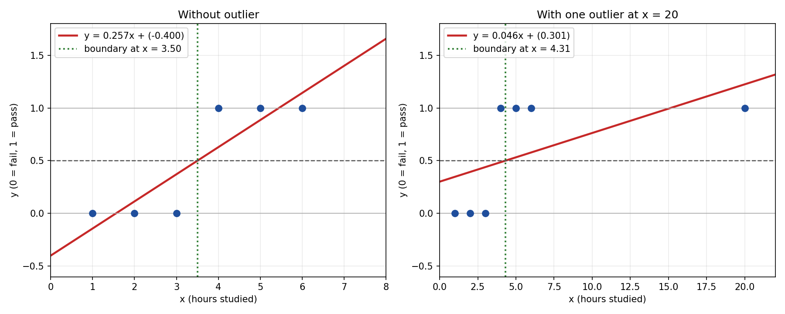
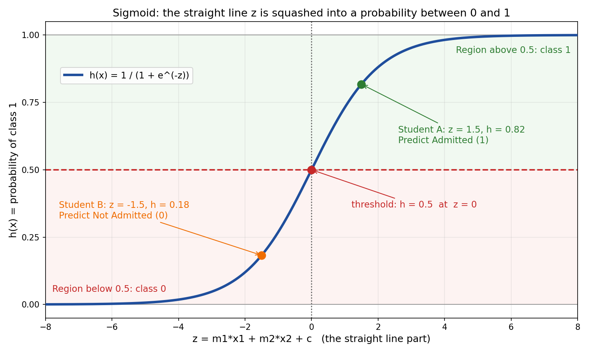

# Logistic Regression: From y = mx + c to Probabilities

This guide starts from the straight line you already know, shows where it breaks when the answer is Yes or No, and then shows the small change that fixes it.

Files used by this guide (keep them in the same folder as this .md file):

- `linear_regression_problem.png`
- `sigmoid_threshold.png`

---

## Table of Contents

1. Why not linear regression?
2. How the formula changes, step by step
3. The sigmoid function and the 0.5 threshold
4. Full worked example: admission prediction
5. What the numbers mean
6. Linear vs logistic at a glance
7. Quick recap

---

## 1. Why not linear regression?

Suppose we want to predict a Yes or No outcome:

- Will the student be admitted? (1 = Yes, 0 = No)
- Will the student pass? (1 = Pass, 0 = Fail)

The target `y` can only be **0 or 1**. Let us see what happens if we just use the usual line `y = mx + c` anyway.

### Issue 1: The output is not a valid probability

A straight line never stops. It keeps going up and down forever, so it can produce numbers below 0 and above 1.

Take the admission line with these values:

```
y = 1(GPA) + 0.05(Exam) - 6
```

| Student | GPA | Exam | Calculation | y |
|---------|-----|------|-------------|---|
| Strong | 4.0 | 100 | 4.0 + 5.0 - 6 | **3.0** |
| Weak | 2.0 | 30 | 2.0 + 1.5 - 6 | **-2.5** |

- A probability of 3.0 means 300 percent. That is impossible.
- A probability of -2.5 means negative 250 percent. That is also impossible.

We need an output that is always trapped between 0 and 1.

### Issue 2: A straight line does not match 0/1 data

The true answers jump from 0 to 1. They do not slope gently. A line is a poor shape for that kind of data.

### Issue 3: One outlier can move the decision boundary

Take 6 students, where `x` is hours studied and `y` is pass (1) or fail (0):

| x (hours) | 1 | 2 | 3 | 4 | 5 | 6 |
|-----------|---|---|---|---|---|---|
| y | 0 | 0 | 0 | 1 | 1 | 1 |

**Fit a line (least squares).**

```
mean of x = 3.5
mean of y = 0.5

m = 4.5 / 17.5 = 0.257
c = 0.5 - (0.257)(3.5) = -0.4

y = 0.257x - 0.4
```

Where does the line cross 0.5?

```
0.257x - 0.4 = 0.5
x = 3.5
```

So students with 4 hours or more are predicted to pass. This is correct.

**Now add one student who studied 20 hours and passed (a perfectly normal result).**

The best fit line changes to:

```
y = 0.046x + 0.301
```

Where does it cross 0.5 now?

```
0.046x + 0.301 = 0.5
x = 4.31
```

Check the student with 4 hours:

```
y = 0.046(4) + 0.301 = 0.486
```

0.486 is below 0.5, so this student is now predicted to **fail**, even though they actually passed. One extra correct data point damaged a prediction that was previously right.



### Summary of the problems

| Problem | Why it hurts |
|---------|--------------|
| Output goes below 0 and above 1 | Cannot be read as a probability |
| Straight line vs 0/1 jump | Poor fit to the shape of the data |
| Sensitive to far away points | The 0.5 boundary shifts for the wrong reason |

**What we want:** keep the useful part of the line (weighting each feature), but force the final answer to stay between 0 and 1.

---

## 2. How the formula changes, step by step

### Step 1: Simple linear regression (one feature)

```
y = mx + c
```

- `m` is the slope (how much y changes when x changes by 1)
- `c` is the intercept (the starting value when x = 0)

### Step 2: Add more features

Each feature gets its **own slope**, because each feature pushes the result by a different amount.

```
y = m1*x1 + m2*x2 + c
```

For admission prediction:

- `x1` = GPA, `m1` = how strongly GPA pushes toward admission
- `x2` = Exam score, `m2` = how strongly the exam score pushes toward admission
- `c` = the baseline before any feature is counted

Both effects add up into a single number.

### Step 3: Give the line a new name, z

We keep exactly the same line but call it `z`. It is no longer the final answer. It is only the raw score.

```
z = m1*x1 + m2*x2 + c
```

`z` can be any number from very negative to very positive. That is fine, because the next step fixes the range.

### Step 4: Squash z with the sigmoid

```
h(x) = 1 / (1 + e^(-z))
```

The sigmoid takes any number and returns a value strictly between 0 and 1.

### Step 5: The full logistic regression formula

Replace `z` with the line:

```
h(x) = 1 / (1 + e^-(m1*x1 + m2*x2 + c))
```

This is literally `y = mx + c` placed inside the sigmoid.

### Step 6: Meaning of the notation h(x) and theta

Many textbooks write the same thing with the letter theta. Nothing new is happening, only the names change.

| mx + c notation | Theta notation | Meaning |
|-----------------|----------------|---------|
| `c` | `theta0` | intercept (baseline) |
| `m1` | `theta1` | weight of feature 1 (GPA) |
| `m2` | `theta2` | weight of feature 2 (Exam) |
| `z` | `theta0 + theta1*x1 + theta2*x2` | raw score |
| `h(x)` | `h_theta(x)` | predicted probability |

- `h` stands for hypothesis, which means the prediction
- `theta` stands for the parameters, which means all the slopes and the intercept
- `x` stands for the features

### The whole evolution in one view

```
y = mx + c                          (one feature, continuous output)
        |
        v
y = m1*x1 + m2*x2 + c               (many features, still a line)
        |
        v
z = m1*x1 + m2*x2 + c               (rename it: raw score)
        |
        v
h(x) = 1 / (1 + e^(-z))             (squash into 0 to 1)
        |
        v
if h(x) >= 0.5  ->  predict 1
if h(x) <  0.5  ->  predict 0
```

---

## 3. The sigmoid function and the 0.5 threshold

The diagram below shows the sigmoid curve. The horizontal axis is `z` (the line part) and the vertical axis is the probability `h(x)`.



### Key points to read from the graph

| Where z is | What h(x) does | Meaning |
|------------|----------------|---------|
| Very negative (like -6) | Close to 0 | Very confident: class 0 |
| Exactly 0 | Exactly 0.5 | Undecided, this is the threshold |
| Very positive (like +6) | Close to 1 | Very confident: class 1 |

### Sigmoid values table

| z | e^(-z) | 1 + e^(-z) | h = 1 / (1 + e^(-z)) |
|---|--------|------------|----------------------|
| -6 | 403.43 | 404.43 | 0.0025 |
| -4 | 54.60 | 55.60 | 0.0180 |
| -2 | 7.389 | 8.389 | 0.1192 |
| -1 | 2.718 | 3.718 | 0.2689 |
| **0** | **1.000** | **2.000** | **0.5000** |
| 1 | 0.368 | 1.368 | 0.7311 |
| 2 | 0.135 | 1.135 | 0.8808 |
| 4 | 0.018 | 1.018 | 0.9820 |
| 6 | 0.0025 | 1.0025 | 0.9975 |

### Why the threshold sits at z = 0

```
h = 0.5
1 / (1 + e^(-z)) = 0.5
1 + e^(-z) = 2
e^(-z) = 1
-z = 0
z = 0
```

So the rule "predict 1 when h is at least 0.5" is the same as the rule "predict 1 when z is at least 0".

```
h(x) >= 0.5   <=>   z >= 0   <=>   m1*x1 + m2*x2 + c >= 0
```

### Text version of the graph

```
h(x)
1.0 |                           ___________  <- close to 1 (class 1)
    |                      ____/
0.75|                  __/
    |               _/
0.5 |- - - - - - -o - - - - - - - - - -  <- threshold
    |           _/  
0.25|        __/
    |  ____/
0.0 |_/____________________________________ z
   -6    -3     0      3      6
   class 0     |     class 1
          decision boundary (z = 0)
```

The threshold of 0.5 is the default, not a law. If a wrong Yes is very costly (for example, approving a risky loan), you can raise it to 0.7 or 0.8. If missing a real Yes is costly (for example, detecting a disease), you can lower it.

---

## 4. Full worked example: admission prediction

### Given values (using the mx + c style)

```
m1 = 1      (GPA slope)
m2 = 0.05   (Exam score slope)
c  = -6     (intercept)
```

Full model:

```
z    = 1*(GPA) + 0.05*(Exam) + (-6)
h(x) = 1 / (1 + e^(-z))
```

### Student A: GPA = 3.5, Exam = 80

**Step A: Compute the line (z)**

```
z = (1)(3.5) + (0.05)(80) + (-6)
z = 3.5 + 4.0 - 6
z = 1.5
```

**Step B: Compute e^(-z)**

```
e^(-1.5) = 0.2231
```

**Step C: Apply the sigmoid**

```
h(x) = 1 / (1 + 0.2231)
h(x) = 1 / 1.2231
h(x) = 0.8176   (about 82 percent)
```

**Step D: Apply the threshold**

```
0.8176 >= 0.5   ->   Predict Admitted (Y = 1)
```

### Student B: GPA = 2.5, Exam = 40

```
z = (1)(2.5) + (0.05)(40) - 6
z = 2.5 + 2.0 - 6
z = -1.5

e^(-(-1.5)) = e^(1.5) = 4.4817

h(x) = 1 / (1 + 4.4817)
h(x) = 1 / 5.4817
h(x) = 0.1824   (about 18 percent)

0.1824 < 0.5   ->   Predict Not Admitted (Y = 0)
```

### Student C: GPA = 3.0, Exam = 60 (borderline)

```
z = (1)(3.0) + (0.05)(60) - 6
z = 3.0 + 3.0 - 6
z = 0

h(x) = 1 / (1 + e^0)
h(x) = 1 / (1 + 1)
h(x) = 0.5
```

This student sits exactly on the decision boundary. The model is completely undecided.

### Compare with the earlier linear regression problem

Remember the strong student (GPA 4.0, Exam 100) who got y = 3.0 and the weak student (GPA 2.0, Exam 30) who got y = -2.5 from the plain line? Now pass their z values through the sigmoid.

| Student | z | h(x) | Result |
|---------|---|------|--------|
| Strong (4.0, 100) | 3.0 | 1 / (1 + e^-3) = 1 / 1.0498 = **0.9526** | Admitted |
| Weak (2.0, 30) | -2.5 | 1 / (1 + e^2.5) = 1 / 13.182 = **0.0759** | Not admitted |

Both answers are now valid probabilities. The problem from Section 1 is solved.

### Summary table for all students

| Student | GPA | Exam | z | h(x) | Prediction |
|---------|-----|------|---|------|------------|
| A | 3.5 | 80 | 1.5 | 0.8176 | Admitted (1) |
| B | 2.5 | 40 | -1.5 | 0.1824 | Not admitted (0) |
| C | 3.0 | 60 | 0.0 | 0.5000 | On the boundary |

---

## 5. What the numbers mean

### The decision boundary is still a straight line

Setting `z = 0` gives:

```
1*(GPA) + 0.05*(Exam) - 6 = 0
```

Example points on this line:

| GPA | Exam needed |
|-----|-------------|
| 4.0 | 40 |
| 3.0 | 60 |
| 2.0 | 80 |
| 1.0 | 100 |

Any student above this line gets a probability higher than 0.5. Any student below it gets a probability lower than 0.5. That is why logistic regression is called a **linear classifier**, even though the sigmoid curve bends.

### Each slope is a "push" on the balance scale

- `m1 = 1`: every extra GPA point adds 1 to z
- `m2 = 0.05`: every extra exam mark adds 0.05 to z
- `c = -6`: the starting handicap that must be overcome

A positive slope pushes toward admission. A negative slope would push away from admission.

### Effect of a small change

Student A had z = 1.5 and h = 0.8176. Raise the exam score by 10 marks:

```
z = 1.5 + (0.05)(10) = 2.0
h = 1 / (1 + e^-2) = 0.8808
```

The probability rises from 81.8 percent to 88.1 percent. Notice it is not a fixed jump. The same change in z moves the probability a lot near z = 0 and only a little near the flat ends of the curve.

### z is the log of the odds (optional, but useful)

Odds are `p / (1 - p)`. For Student A:

```
p    = 0.8176
odds = 0.8176 / 0.1824 = 4.48
ln(4.48) = 1.5   <-- this is exactly z
```

So the line `z = mx + c` is really modelling the **log-odds**. Each unit increase in GPA multiplies the odds of admission by `e^1 = 2.718`, and each extra exam mark multiplies the odds by `e^0.05 = 1.051`.

---

## 6. Linear vs logistic at a glance

| Feature | Linear regression | Logistic regression |
|---------|-------------------|---------------------|
| Predicts | A number (salary, marks) | A probability, then a class |
| Formula | `y = m1*x1 + m2*x2 + c` | `h = 1 / (1 + e^-(m1*x1 + m2*x2 + c))` |
| Output range | Minus infinity to plus infinity | 0 to 1 |
| Curve shape | Straight line | S shaped (sigmoid) |
| Threshold | Not needed | Usually 0.5 (z = 0) |
| Typical use | Price, temperature, score | Admit or reject, spam or not, pass or fail |

---

## 7. Quick recap

1. Linear regression gives values below 0 and above 1, fits 0/1 data badly, and is thrown off by outliers.
2. Logistic regression keeps the same line `z = m1*x1 + m2*x2 + c`.
3. It passes `z` through the sigmoid `h = 1 / (1 + e^(-z))` to get a value between 0 and 1.
4. `theta0` is just `c`, and `theta1`, `theta2`, and so on are just `m1`, `m2`, and so on.
5. If `h >= 0.5` (which means `z >= 0`), predict 1. Otherwise predict 0.
6. Student A: z = 1.5, h = 0.82, so the prediction is Admitted.

**One line to remember:** logistic regression is a straight line that has been bent into a probability.
