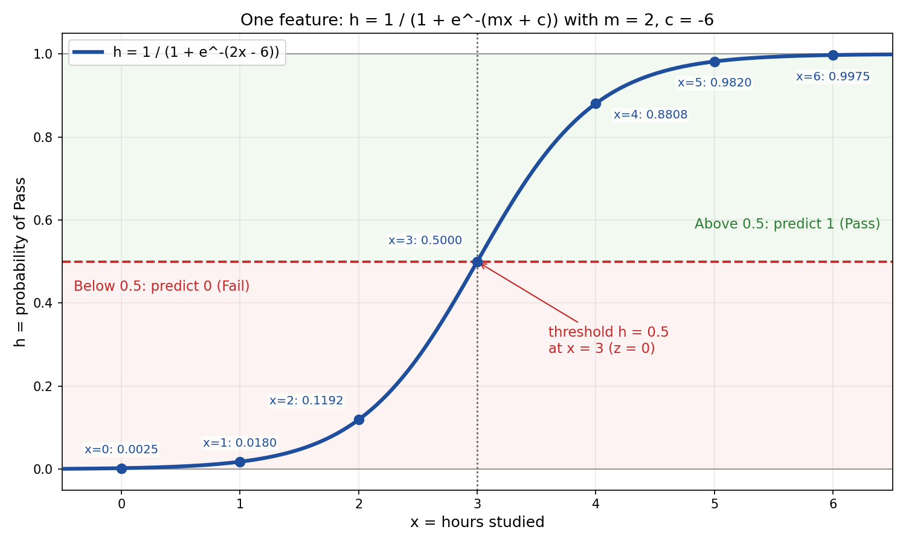
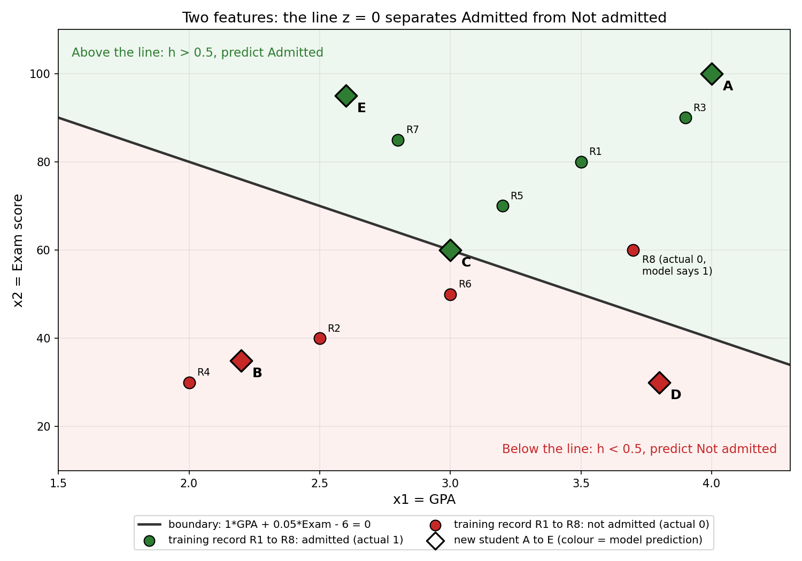
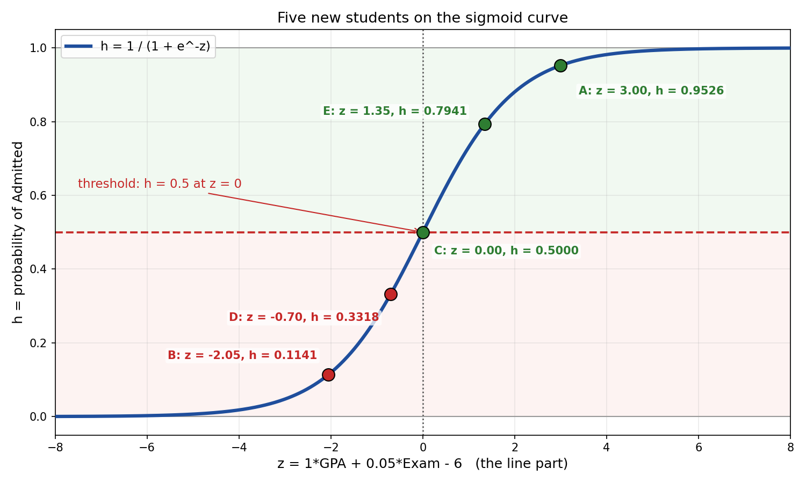

# Logistic Regression: Tuning y = mx + c into a Probability

This guide takes the straight line `y = mx + c` and tunes it, one small step at a time, into logistic regression. Then it works through real numbers: one feature first, then two features, then where the slopes and intercept come from, and finally five students scored with the same values.

Files used by this guide (keep them in the same folder as this .md file):

- `diagram_1_one_feature_sigmoid.png`
- `diagram_2_two_feature_boundary.png`
- `diagram_3_students_on_sigmoid.png`

---

## Table of Contents

1. The formula: tuning y = mx + c
2. See what the formula gives (one feature)
3. Two features
4. What m1, m2 and c mean, and where the values come from
5. Apply the values on one record
6. Apply the values on all the records
7. Five new students with the same m and c
8. What to notice
9. Recap

---

## 1. The formula: tuning y = mx + c

We start from the line we already know and change it in small steps.

**Step 1: the line**

```
y = mx + c
```

- `m` is the slope, `c` is the intercept.
- The output can be any number, big or small, positive or negative.

**Step 2: give the line a new name, z**

```
z = mx + c
```

Nothing changed in the maths. We only renamed it. `z` is now the raw score, not the final answer.

**Step 3: pass z through the sigmoid function**

```
h = 1 / (1 + e^-z)
```

The sigmoid takes any number and returns a value strictly between 0 and 1. That is exactly what a probability looks like.

**Step 4: put the line inside the sigmoid**

```
h = 1 / (1 + e^-(mx + c))
```

This is logistic regression. It is the same line `mx + c`, wrapped inside the sigmoid.

**Step 5: turn the probability into a decision**

```
if h >= 0.5  ->  predict 1  (Yes)
if h <  0.5  ->  predict 0  (No)
```

**The whole change in one view**

```
y = mx + c                      the line
      |
      v
z = mx + c                      same line, renamed as raw score
      |
      v
h = 1 / (1 + e^-z)              squash the score into 0 to 1
      |
      v
h = 1 / (1 + e^-(mx + c))       the logistic regression formula
      |
      v
h >= 0.5 -> 1, else 0           the decision
```

**Notation note.** Many books write the same thing with theta. Only the names change:

| mx + c notation | Theta notation |
|-----------------|----------------|
| `c` | `theta0` |
| `m1` | `theta1` |
| `m2` | `theta2` |
| `h` | `h_theta(x)` |

`h` stands for hypothesis, which means the prediction.

---

## 2. See what the formula gives (one feature)

Let the feature be `x` = hours studied, and the target be Pass (1) or Fail (0).

Suppose the values are:

```
m = 2
c = -6
```

So the formula becomes:

```
h = 1 / (1 + e^-(2x - 6))
```

### Worked calculations

**x = 1 hour**

```
z = 2(1) - 6 = -4
e^-z = e^4 = 54.598
h = 1 / (1 + 54.598) = 1 / 55.598 = 0.0180
0.0180 < 0.5  ->  predict 0 (Fail)
```

**x = 3 hours**

```
z = 2(3) - 6 = 0
e^-z = e^0 = 1
h = 1 / (1 + 1) = 0.5
```

**x = 5 hours**

```
z = 2(5) - 6 = 4
e^-z = e^-4 = 0.0183
h = 1 / (1 + 0.0183) = 1 / 1.0183 = 0.9820
0.9820 >= 0.5  ->  predict 1 (Pass)
```

### Full table

| x (hours) | z = 2x - 6 | e^-z | h = 1 / (1 + e^-z) | Prediction |
|-----------|------------|------|--------------------|------------|
| 0 | -6 | 403.43 | 0.0025 | 0 (Fail) |
| 1 | -4 | 54.598 | 0.0180 | 0 (Fail) |
| 2 | -2 | 7.389 | 0.1192 | 0 (Fail) |
| **3** | **0** | **1.000** | **0.5000** | **boundary** |
| 4 | 2 | 0.1353 | 0.8808 | 1 (Pass) |
| 5 | 4 | 0.0183 | 0.9820 | 1 (Pass) |
| 6 | 6 | 0.0025 | 0.9975 | 1 (Pass) |



### What this shows

- The line part `z` goes from -6 to +6. That is a wide range.
- After the sigmoid, every value sits between 0 and 1.
- The curve is S shaped. It changes fast near the middle and slowly at both ends.
- `h = 0.5` happens exactly where `z = 0`. Here that is `2x - 6 = 0`, so `x = 3`.

**Why the threshold is at z = 0**

```
1 / (1 + e^-z) = 0.5
1 + e^-z = 2
e^-z = 1
z = 0
```

So "h is at least 0.5" is the same as "z is at least 0". The decision boundary is where the line `mx + c` crosses zero:

```
x = -c / m = -(-6) / 2 = 3
```

---

## 3. Two features

Now let us predict college admission using two features:

- `x1` = GPA (out of 4)
- `x2` = Exam score (out of 100)

Each feature needs its own slope, because each one pushes the result by a different amount. The line grows by one term:

```
z = m1*x1 + m2*x2 + c
```

Then the same sigmoid is applied:

```
h = 1 / (1 + e^-(m1*x1 + m2*x2 + c))
```

- `m1` is the slope of GPA
- `m2` is the slope of Exam score
- `c` is the baseline, the starting point before any feature is counted

Nothing else changes. The single feature formula from Section 2 is just this formula with only one term.

---

## 4. What m1, m2 and c mean, and where the values come from

### The data

The slopes and intercept are not guessed by hand. They are **derived from data**: past students whose result we already know. Here is a small set of past records:

| Record | GPA (x1) | Exam (x2) | Actual result (y) |
|--------|----------|-----------|-------------------|
| R1 | 3.5 | 80 | 1 (Admitted) |
| R2 | 2.5 | 40 | 0 (Not admitted) |
| R3 | 3.9 | 90 | 1 (Admitted) |
| R4 | 2.0 | 30 | 0 (Not admitted) |
| R5 | 3.2 | 70 | 1 (Admitted) |
| R6 | 3.0 | 50 | 0 (Not admitted) |
| R7 | 2.8 | 85 | 1 (Admitted) |
| R8 | 3.7 | 60 | 0 (Not admitted) |

### How training finds the values

Training is a loop:

1. Start with a guess, for example `m1 = 0`, `m2 = 0`, `c = 0`. Every student then gets `h = 0.5`.
2. For each record, compute `z` and then `h`.
3. Compare `h` with the real result. If the real result is 1 and `h` is small, the error is large. If the real result is 0 and `h` is large, the error is also large.
4. Nudge `m1`, `m2` and `c` a little in the direction that reduces the total error. This method is called gradient descent.
5. Repeat until the error stops getting smaller.

The error measure used in logistic regression is called log loss:

```
if actual = 1 :  error = -ln(h)
if actual = 0 :  error = -ln(1 - h)
```

For example, record R1 (actual 1) with `h = 0.8176` has error `-ln(0.8176) = 0.2014`, which is small. A record that is predicted badly gets a much larger error, and training keeps adjusting until the overall error is as low as it can get.

### The values we get

Suppose training on records like these gives:

```
m1 = 1        (slope for GPA)
m2 = 0.05     (slope for Exam score)
c  = -6       (intercept)
```

Note: these numbers are chosen so the arithmetic stays clean and they fit the records above well. In a real project a library finds the values for you, and they usually come out less round.

The final model is:

```
z = 1*(GPA) + 0.05*(Exam) - 6
h = 1 / (1 + e^-z)
```

From now on, **the same m1, m2 and c are used for every student**. Only the GPA and Exam values change.

### What each value means in this example

| Value | Meaning in this example |
|-------|-------------------------|
| `m1 = 1` | Every extra GPA point adds 1 to z, which pushes toward admission. |
| `m2 = 0.05` | Every extra exam mark adds 0.05 to z. Ten more marks adds 0.5. |
| `c = -6` | The starting handicap. A student with GPA 0 and Exam 0 has z = -6, so h = 0.0025. The features must add up to more than 6 before z turns positive. |

Some useful ways to read the slopes:

- **Trade off:** 1 GPA point adds 1 to z, and 20 exam marks add `20 x 0.05 = 1`. So 1 GPA point is worth 20 exam marks.
- **Why m2 looks small:** the exam score goes up to 100, but GPA only goes up to 4. A small slope on a big number gives a fair contribution: the maximum from GPA is `1 x 4 = 4` and the maximum from Exam is `0.05 x 100 = 5`.
- **Best possible student:** GPA 4.0 and Exam 100 gives `z = 4 + 5 - 6 = 3`.
- **Worst possible student:** GPA 0 and Exam 0 gives `z = -6`.

### The decision boundary

The boundary is where `z = 0`:

```
1*(GPA) + 0.05*(Exam) - 6 = 0
Exam = 120 - 20*(GPA)
```

| GPA | Exam needed to reach h = 0.5 |
|-----|------------------------------|
| 4.0 | 40 |
| 3.5 | 50 |
| 3.0 | 60 |
| 2.5 | 70 |
| 2.0 | 80 |

Above this line, `h` is above 0.5 (predict Admitted). Below it, `h` is below 0.5 (predict Not admitted).



---

## 5. Apply the values on one record

Take record R1: GPA = 3.5, Exam = 80.

**Step 1: compute z (the line part)**

```
z = m1*x1 + m2*x2 + c
z = (1)(3.5) + (0.05)(80) + (-6)
z = 3.5 + 4.0 - 6
z = 1.5
```

**Step 2: compute e^-z**

```
e^-1.5 = 0.2231
```

**Step 3: apply the sigmoid**

```
h = 1 / (1 + 0.2231)
h = 1 / 1.2231
h = 0.8176
```

**Step 4: apply the threshold**

```
0.8176 >= 0.5  ->  predict 1 (Admitted)
```

The model says there is about an 82 percent chance of admission. The actual result was 1, so the prediction is correct.

---

## 6. Apply the values on all the records

The same steps for all eight records:

| Record | GPA | Exam | z | e^-z | h | Predicted | Actual | Correct? |
|--------|-----|------|---|------|---|-----------|--------|----------|
| R1 | 3.5 | 80 | 1.50 | 0.2231 | 0.8176 | 1 | 1 | Yes |
| R2 | 2.5 | 40 | -1.50 | 4.4817 | 0.1824 | 0 | 0 | Yes |
| R3 | 3.9 | 90 | 2.40 | 0.0907 | 0.9168 | 1 | 1 | Yes |
| R4 | 2.0 | 30 | -2.50 | 12.1825 | 0.0759 | 0 | 0 | Yes |
| R5 | 3.2 | 70 | 0.70 | 0.4966 | 0.6682 | 1 | 1 | Yes |
| R6 | 3.0 | 50 | -0.50 | 1.6487 | 0.3775 | 0 | 0 | Yes |
| R7 | 2.8 | 85 | 1.05 | 0.3499 | 0.7408 | 1 | 1 | Yes |
| R8 | 3.7 | 60 | 0.70 | 0.4966 | 0.6682 | 1 | 0 | **No** |

**Result: 7 out of 8 correct (87.5 percent).**

R8 is the one miss. The student has a good GPA (3.7) and a fair exam score (60), so the model gives a 67 percent chance, but this student was not admitted. Real data always has cases like this, because admission depends on things the two features cannot see. Logistic regression does not need to be perfect. It needs to give sensible probabilities, and here it does: the wrong prediction is also the one with the largest error (`-ln(1 - 0.6682) = 1.10`, compared with 0.08 to 0.47 for the correct records).

---

## 7. Five new students with the same m and c

These students are not in the records. We use the same values:

```
m1 = 1,  m2 = 0.05,  c = -6
```

### Student A: GPA = 4.0, Exam = 100 (very strong)

```
z = (1)(4.0) + (0.05)(100) - 6
z = 4.0 + 5.0 - 6 = 3.0
e^-3.0 = 0.0498
h = 1 / (1 + 0.0498) = 1 / 1.0498 = 0.9526
0.9526 >= 0.5  ->  Admitted
```

### Student B: GPA = 2.2, Exam = 35 (weak)

```
z = (1)(2.2) + (0.05)(35) - 6
z = 2.2 + 1.75 - 6 = -2.05
e^2.05 = 7.7679
h = 1 / (1 + 7.7679) = 1 / 8.7679 = 0.1141
0.1141 < 0.5  ->  Not admitted
```

### Student C: GPA = 3.0, Exam = 60 (on the boundary)

```
z = (1)(3.0) + (0.05)(60) - 6
z = 3.0 + 3.0 - 6 = 0
e^0 = 1
h = 1 / (1 + 1) = 0.5000
```

The model is completely undecided. With the rule `h >= 0.5`, this student would be predicted as Admitted, but it is really a coin flip.

### Student D: GPA = 3.8, Exam = 30 (high GPA, low exam)

```
z = (1)(3.8) + (0.05)(30) - 6
z = 3.8 + 1.5 - 6 = -0.7
e^0.7 = 2.0138
h = 1 / (1 + 2.0138) = 1 / 3.0138 = 0.3318
0.3318 < 0.5  ->  Not admitted
```

### Student E: GPA = 2.6, Exam = 95 (low GPA, high exam)

```
z = (1)(2.6) + (0.05)(95) - 6
z = 2.6 + 4.75 - 6 = 1.35
e^-1.35 = 0.2592
h = 1 / (1 + 0.2592) = 1 / 1.2592 = 0.7941
0.7941 >= 0.5  ->  Admitted
```

### Summary of the five students

| Student | GPA | Exam | z | h | Prediction |
|---------|-----|------|---|---|------------|
| A | 4.0 | 100 | 3.00 | 0.9526 | Admitted (1) |
| B | 2.2 | 35 | -2.05 | 0.1141 | Not admitted (0) |
| C | 3.0 | 60 | 0.00 | 0.5000 | On the boundary |
| D | 3.8 | 30 | -0.70 | 0.3318 | Not admitted (0) |
| E | 2.6 | 95 | 1.35 | 0.7941 | Admitted (1) |



---

## 8. What to notice

- **One model, many students.** The values `m1 = 1`, `m2 = 0.05`, `c = -6` never changed. Only the inputs changed.
- **z is the straight line, h is the probability.** Student A has z = 3 and h = 0.95. Student B has z = -2.05 and h = 0.11. The sigmoid turns any z into a valid probability.
- **Both features matter.** Student D has a very good GPA of 3.8 but is rejected, because the exam score is too low. To pass with GPA 3.8, the exam must satisfy `0.05 x Exam >= 2.2`, so the exam score must be at least 44, and D has only 30.
- **One feature can make up for the other.** Student E has a low GPA of 2.6 but is admitted, because a 95 on the exam is more than the 68 needed at that GPA (`0.05 x Exam >= 3.4`).
- **h is a confidence level.** 0.95 means very confident, 0.50 means undecided, 0.11 means confident of rejection.
- **The threshold is a choice.** 0.5 is the default. If a wrong Yes is costly, raise it (for example 0.7). If missing a real Yes is costly, lower it.

---

## 9. Recap

1. Start with the line: `y = mx + c`.
2. Rename it `z` and add one slope per feature: `z = m1*x1 + m2*x2 + c`.
3. Pass it through the sigmoid: `h = 1 / (1 + e^-z)`.
4. `m1`, `m2` and `c` are learned from past records by reducing the error, not chosen by hand. In this guide they are `1`, `0.05` and `-6`.
5. `c` is the baseline, and each slope says how strongly its feature pushes toward Yes.
6. Predict 1 when `h >= 0.5`, which is the same as `z >= 0`. Otherwise predict 0.
7. The same `m` and `c` are then applied to every new student.

**One line to remember:** logistic regression is a straight line `mx + c` that is passed through the sigmoid to become a probability.